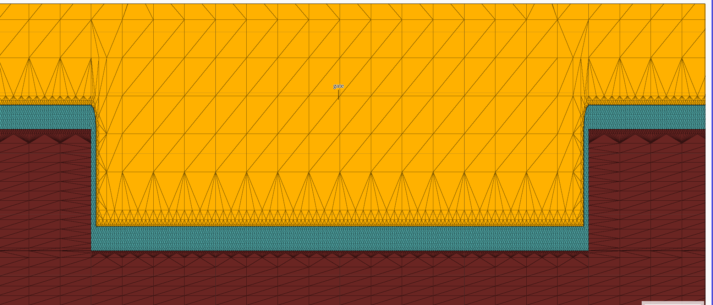

# RUN028 Al2O3 各向近似一致网格硬停止

任务 Session ID：`01a00f0f-a888-78f3-b717-e81e4367a0c7`

RUN028 严格执行网页端最终批准的唯一首轮单变量：保持 RUN026/RUN027 的 DevEdit 几何、`REMESH CONFORMAL SIMPLEX.MINIMAL`、`SPACING=0.25` 和所有其他区域规则不变，只把 `gate_oxide` 的横向 `MAX.SIZE` 从 0.10 μm 收紧至 0.010 μm，纵向继续为 0.005 μm。没有加入 interface、box、shape、edge、corner 或 BetaGa2O3/BetaGa2O3 同材质边界规则。

```text
refine regions="USER:gate_oxide" max.size="0.010,0.005"
```

局部网格图：



## Mesh-only 结果

- 24900 points
- 49382 triangles
- 3617 obtuse triangles，比例 7.32453%
- 峰值内存约 280304 KiB
- swap 为 0
- 11 个区域和 3 个电极均被 ATLAS 只读载入
- drain、gate、source_fp 电极保持
- 未运行任何 Id–Vg、BV 或 SEB

网页端预锁的 obtuse 硬停止线为 5%。RUN028 的 7.32453% 明确越线，因此 mesh-only 判定失败，未生成或启动 RUN029 Id–Vg。

## 只读侧壁核查

将已经完成的 VictoryMesh STR 只读另存为 ASCII 后，直接读取 Al2O3 区域的节点坐标。在侧壁中段 y=0.06515625 μm：

- 左侧节点线：x=4.500000、4.5078125、4.515625、4.520000 μm；
- 右侧节点线：x=6.480000、6.484375、6.4921875、6.500000 μm。

两侧 20 nm Al2O3 均形成 4 条法向节点线，即 3 个完整单元层，达到网页端“至少 2 层、目标 3 层”的层数要求。原始几何仍连续，没有 Nickel/BetaGa2O3 直接接触。

但局部图显示，槽底和两侧转角附近形成成串扇形、针状以及从细密介质网格跨向粗金属/半导体网格的长三角形。10 nm 横向限制解决了侧壁层数，却把整体钝角比例从 RUN026 的 2.9843% 推高到 7.32453%。因此不能用该 STR 做正式器件求解。

## 远端证据

远端目录：`/root/YUE2026_EMODE_GRADED_DOPING/RUN028_VICTORYMESH_AL2O3_ISOTROPIC_MESHONLY/`

- 主 IN：`/root/YUE2026_EMODE_GRADED_DOPING/RUN028_VICTORYMESH_AL2O3_ISOTROPIC_MESHONLY/YUE2026_RUN028_VICTORYMESH_AL2O3_ISOTROPIC_MESHONLY.in`
- DevEdit 原始 STR：`/root/YUE2026_EMODE_GRADED_DOPING/RUN028_VICTORYMESH_AL2O3_ISOTROPIC_MESHONLY/YUE2026_RUN028_VICTORYMESH_AL2O3_ISOTROPIC_devedit_raw.str`
- VictoryMesh STR：`/root/YUE2026_EMODE_GRADED_DOPING/RUN028_VICTORYMESH_AL2O3_ISOTROPIC_MESHONLY/YUE2026_RUN028_VICTORYMESH_AL2O3_ISOTROPIC_vmesh.str`
- 主 TYPESCRIPT：`/root/YUE2026_EMODE_GRADED_DOPING/RUN028_VICTORYMESH_AL2O3_ISOTROPIC_MESHONLY/YUE2026_RUN028_VICTORYMESH_AL2O3_ISOTROPIC_MESHONLY.typescript`
- 只读 ASCII STR：`/root/YUE2026_EMODE_GRADED_DOPING/RUN028_VICTORYMESH_AL2O3_ISOTROPIC_MESHONLY/YUE2026_RUN028_VICTORYMESH_AL2O3_ISOTROPIC_vmesh_ascii.str`

tmux 会话 `yue_run028_al2o3_iso_mesh_20260818` 与只读转换会话均已结束，没有 DeckBuild、VictoryMesh、ATLAS 或 xinternal 计算进程。由于本轮是 mesh-only，实际偏压为不适用。

## 当前冻结点

RUN028 已触发硬停止。不得继续减小 Al2O3 `MAX.SIZE`，不得自行加入 interface refinement，也不得运行 Id–Vg。下一步只能把本记录、代码和局部网格图交给网页端复核；网页端批准新的唯一单变量方案以前不再运行。
